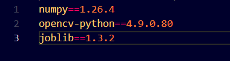
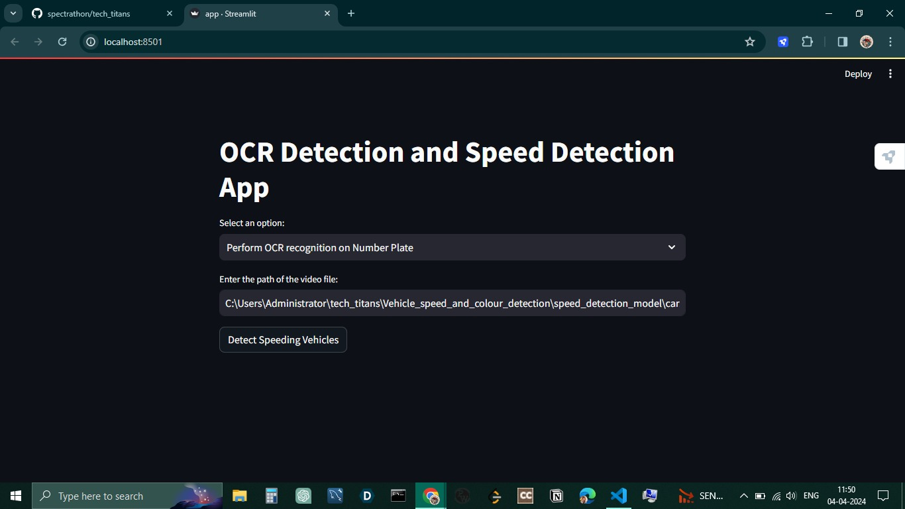

# Tech_Titans_Spectrathon-2024

  
Table of Contents

  <ol>
    <li>
      <a href="#about-the-project">About The Project</a>
      <ul>
        <li><a href="#built-with">Built With</a></li>
      </ul>
    </li>
    <li>
      <a href="#getting-started">Getting Started</a>
    </li>
    <li><a href="#usage">Usage</a></li>
  </ol>

## About the Project

Current security systems often rely on CCTV footage with blurry or low-quality number plates, hindering investigations and identification of vehicles involved in incident. Our project aims to develop a software tool that analyzes pre-recorded video footage stored on DVRs (Digital Video Recorders).

Our project takes a video footage as the input and performs the following features to help detect the vehicle and provide a detailed report as the output which include information such as:

<ul>
    <li>Number Plate Detection and Enhancement</li>
    <li>Character Recognition using OCR (Optical Character Recognition)</li>
    <li>Vehicle Recognition</li>
    <li>Anomaly Detection</li>
    <li>Automatic Report Generation</li>
    <li>Integration with External Databases</li>
</ul>

### Built with
<ul>
    <li>Python</li>
    <li>OpenCV</li>
    <li>Flask</li>
    <li>Pytorch</li>
    <li>YOLO (You Only Look Once) Model</li>
    <li>Numpy</li>
    <li>Pandas</li>
    <li>dlib</li>
</ul>

## Getting Started
<ol>
  <li>Install the dependencies using

   > pip install -r requirements.txt

   
    
  </li>

  <li> Install the dlib library using the command

  > python -m pip install dlib-19.22.99-cp310-cp310-win_amd64.whl

  </li>
  
</ol>

## Usage

You can run the Streamlit app, upload the file and get the prediction